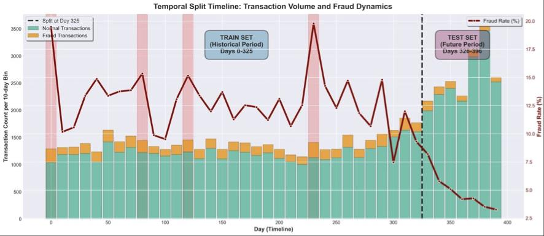
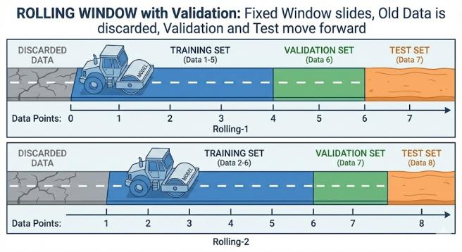
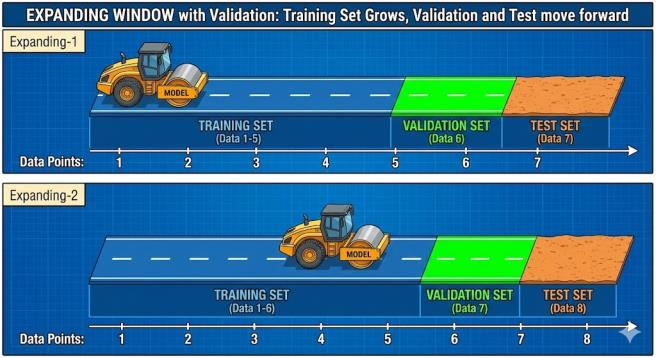
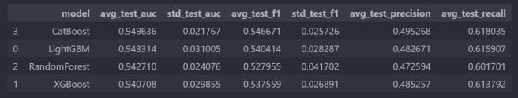
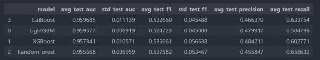
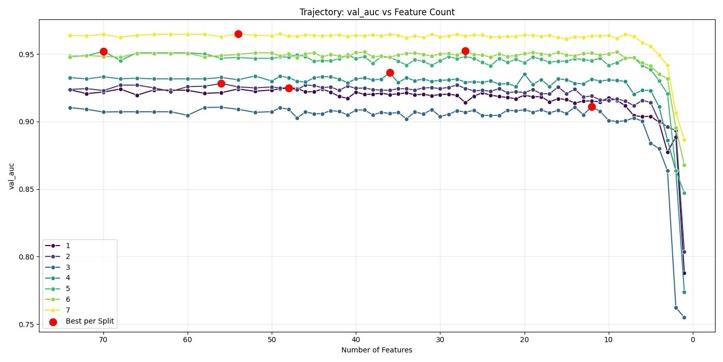
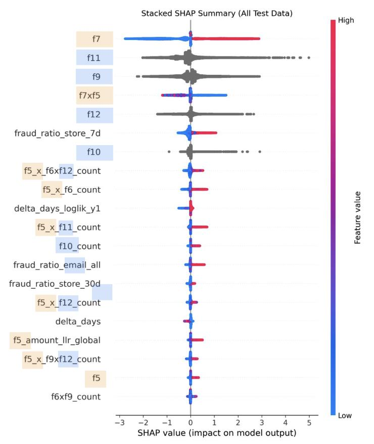

# EC決済における不正取引検知

東京大学 [データサイエンティスト養成講座 (DSS)](https://dss.i.u-tokyo.ac.jp/) [応用課程](https://dss.i.u-tokyo.ac.jp/advance/)（2025年度）にて、**GMOペイメントゲートウェイ株式会社**と共同で取り組んだ、EC決済データにおける不正取引検知の機械学習パイプラインです。応用課程では企業が提供する実データをグループで分析し、課題発見・分析提案・実装・企業へのフィードバックまでを一貫して行います。

> [English README](README_EN.md)

## 課題背景

GMOペイメントゲートウェイは年間決済処理金額約16兆円超（2024年9月期）、稼働店舗数156,575店以上を擁する東証プライム上場の決済インフラ企業です。近年、オンライン決済における不正利用額は毎年過去最高を更新しており、不正検知の高度化は業界全体の喫緊の課題となっています。

未払い取引には、(A) **悪意のある不正取引**（支払いの意思が最初からなく、架空住所の使用・高額転売品の購入など）と (B) **支払いが途絶えるリスクのある取引**（支払い意思はあったが途中で支払わなくなる）の2パターンがあり、いずれも実務上の対処が求められます。不正取引はパターンが多様で発生タイミングも様々であり、担当者の目視や経験知だけでは検知に限界があるため、データを活用した不正検知手法の構築が不可欠です。

GMOからの要件: **検出した不正は確実に本物の不正であること**（高い適合率）を維持しつつ、一定の再現率を確保すること。

**主な技術的課題:**

- **クラス不均衡** -- 不正取引率は約10%（約65,000件中約6,800件）。accuracyは多数派クラスの予測だけで高くなるため、適合率・再現率を重視
- **時間的分布シフト（Prior Shift）** -- 不正率が時間経過とともに変動（学習期間13% → テスト期間5%）
- **データリーケージ防止** -- 実運用と同様に、全ての特徴量は過去のデータのみを使用して算出

## データセット

> データセットは機密情報のため、本リポジトリには含まれていません。

匿名化されたEC取引データ 約65,000件（397日間）。全カラムはマスク化（f3, f4, ...）されており、時間的特徴量・数値特徴量・カテゴリ特徴量・二値特徴量・目的変数（不正フラグ）で構成されています。

### 時間的分布シフト

下図は、取引量（棒グラフ）と不正率（折れ線グラフ）の時間推移を示しています。学習期間（赤色）とテスト期間（緑色）の間で、不正率が大幅に変化していることが確認できます。

<p align="center">
  
</p>

| 期間 | 日数 | 不正率 | 件数 |
|---|---|---|---|
| 初期 | Day 0-99 | 13.5% | 13,941 |
| 中期 | Day 100-199 | 12.5% | 13,544 |
| 後期 | Day 200-299 | 13.3% | 13,278 |
| 直近 | Day 300-396 | **6.0%** | 24,276 |

不正率が13.5%から6.0%へ大幅に低下しています。このような事前分布のシフトがある場合、単純なランダム分割では将来のデータが学習に混入し、過度に楽観的な評価につながるリスクがあります。そのため、時系列の因果性を厳密に担保する検証戦略が不可欠です。

## プロジェクト構成

```text
src/
  preprocessing.py    -- 特徴量エンジニアリング（5カテゴリ 65特徴量）
  validation.py       -- Rolling / Expanding ウォークフォワード分割
  models.py           -- LightGBM, XGBoost, CatBoost, Random Forest
  rfe.py              -- 再帰的特徴量削減（RFE）
  evaluation.py       -- 閾値最適化、評価指標

experiments/
  run_preprocessing.py          -- 生データ → 65特徴量生成
  run_model_comparison.py       -- 4モデル比較（rolling/expanding）
  run_rfe.py                    -- 特徴量選択 → 47個のロバスト特徴量
  run_threshold_optimization.py -- 最小再現率制約下での適合率最適化
  run_shap_analysis.py          -- SHAP特徴量重要度解析
```

## 特徴量エンジニアリング（65特徴量）

初期特徴量が16個と限られる制約の中、5つの方向性で合計65個の特徴量を追加しました。全特徴量は expanding window・累積カウント・shift による遅延集計で算出し、**データリーケージを完全に防止**しています。

### 1. ベース統計（5個）

各ユーザの過去の取引から「通常状態」を算出し、そこからの乖離を特徴量化します。具体的には、ユーザごとの累積取引回数、過去の数値特徴量の平均・標準偏差に加え、対数正規分布を仮定したパラメータ（mu, sigma）をユーザ単位で expanding window により推定します。これにより、ユーザが過去にどのような取引パターンを持っていたかを個人レベルでモデル化できます。

### 2. 特徴構造（10個）

カテゴリ特徴量の出現頻度および組み合わせの共起頻度を特徴量化します。単体頻度（5個）、2カテゴリの共起頻度（3個）、3カテゴリの共起頻度（1個）、頻度の積（1個）を cumcount で算出。不正取引では稀なカテゴリの組み合わせが多い傾向があり、頻度情報はそのシグナルを捉えます。

### 3. ルールベース（7個）

ドメイン知識に基づく特徴量です。数値特徴量の末尾パターン（キリの良い数値かどうかで3個）、カテゴリの前回取引からの変更フラグ（3個）、および**二値特徴量と数値特徴量の交互作用項**（1個）を構築します。

特に交互作用項は本研究の重要な設計で、「特定の属性を持つユーザの高額取引」のみを明示的に抽出します。二値特徴量が1の場合は数値特徴量の値をそのまま返し、0の場合は0を返す設計により、条件付きでのみ数値特徴量の大きさが不正検知に寄与するようにしています。

### 4. 特徴強調（10個）

数値特徴量を各カテゴリの出現頻度の対数で割ることで、「その頻度にしては異常に高い値」を強調します。例えば、出現頻度が非常に低いカテゴリで高い数値が観測された場合、この特徴量は大きな値を取ります。全てのcount系特徴量に対して算出。

### 5. 統計モデル（33個）

確率・異常度に基づく特徴量です。以下のサブグループで構成されます:

| サブグループ | 個数 | 内容 |
|---|---|---|
| カテゴリ別不正率（4グループ × 3窓） | 20 | カテゴリごとに、過去7日/30日/全期間の不正取引割合とデータ件数 |
| グローバルLLR | 4 | 数値特徴量の対数尤度比（全体分布） |
| 個人LLR | 2 | 数値特徴量の対数尤度比（ユーザ個人分布） |
| 取引間隔LLR | 5 | 取引間隔の対数尤度比 |
| 過去平均との乖離 | 2 | ユーザの過去平均に対する比率・標準化スコア |

**LLR（対数尤度比）** は、観測値が「正常取引の分布」と「不正取引の分布」のどちらに近いかを数値化する手法です。対数正規分布を仮定し、expanding window でパラメータを推定します。LLR > 0 であれば不正取引の分布に近く、LLR < 0 であれば正常取引の分布に近いことを意味します。数値特徴量そのものだけでなく、取引間隔にも同じ手法を適用することで、時間軸上の異常パターンも捉えます。

## クラス不均衡への対処

不正取引は全取引の約10%であり、多くの学習アルゴリズムでは多数派クラスが損失関数を支配し、少数派クラスの学習が不十分になります。この課題に対し、全モデルにおいて**クラスウェイト調整**（`class_weight="balanced"`）を適用しました。不正取引に高いウェイトを割り当てることで、損失関数における少数派クラスの影響力を増大させ、不正検知性能（特に再現率）の低下を防いでいます。オーバーサンプリングやアンダーサンプリングと異なり、元のデータサイズと分布を保持しながら不均衡に対処できる利点があります。

## 検証戦略

不正検知は本質的に時間依存の問題であり、過去のデータで学習し将来のデータを予測する必要があります。ランダム分割は将来データのリーケージを引き起こすため不適切です。時系列の因果性を担保するため、以下の2つのウォークフォワード戦略を採用しました（`[Train=50%, Val=10%, Test=10%, Step=5%]`、計7 fold）。

### Rolling Window

固定サイズの学習窓が前方にスライドし、古いデータは破棄されます。直近の不正パターンへの適応力を重視し、短期的なコンセプトドリフトに強い手法です。

<p align="center">
  
</p>

- 利点: 最近の傾向変化への迅速な適応、古いパターンの影響を排除
- 制約: 長期的な履歴情報を破棄、データが疎な場合に性能が不安定

### Expanding Window

学習窓がデータ先頭から拡大し、全ての過去データを蓄積します。長期的パターンの安定性を重視し、データが疎な場合でも安定した性能を発揮します。

<p align="center">
  
</p>

- 利点: 長期的なパターンの安定的な学習、データ量の確保
- 制約: 分布シフトへの適応が遅い

### 評価結果

両戦略で同一の4モデル（LightGBM, XGBoost, CatBoost, Random Forest）を評価した結果、**Rolling Windowがより安定かつ信頼性の高い性能**を示したため、最終的にRolling Windowを採用しました。

<p align="center">
  
</p>
<p align="center">Rolling Window検証での各モデルの平均テスト性能</p>

<p align="center">
  
</p>
<p align="center">Expanding Window検証での各モデルの平均テスト性能</p>

また、単純な時系列分割（学習: Day 0-325、テスト: Day 326-396）により、学習期間の不正率13%（5,842件）に対しテスト期間は5%（957件）と、大幅なクラス事前分布のシフトを確認しています。

## 特徴量選択（RFE）

不要な特徴量を削減して汎化性能を向上させ、モデルの解釈性を高めるため、LightGBMのFeature Importance (gain) を用いた再帰的特徴量削減を行いました。

**アルゴリズム:**

1. 特徴量セットを全特徴量で初期化
2. 現在の特徴量セットでLightGBMを訓練
3. 特徴量重要度（gainタイプ）を取得、検証AUCを記録
4. 重要度が最も低い特徴量を1個削除
5. 特徴量が1つになるまで繰り返し
6. 全iterationで最大の検証AUCを達成した特徴量セットを出力

7つのRolling Splitで実行した結果、最適特徴量数は**12-70の範囲で変動**しました（下図）。これは時間経過に伴うデータ分布の変化を反映しており、単一のsplitに依存しない特徴量選択の重要性を示しています。

<p align="center">
  
</p>
<p align="center">RFEによる検証AUCスコアの変化。横軸: 残特徴量数、縦軸: 検証AUC。赤い点は各foldにおける最大AUCの点を表す</p>

最終的に**半数以上（4 fold以上）で選択されたロバスト特徴量47個**を採用。全7 foldで選択された特徴量は10個で、元のカテゴリ特徴量（5個）、交互作用項（1個）、特徴強調（2個）、カテゴリ別不正率（2個）から構成されています。

## モデル評価結果

勾配ブースティング系を中心に4モデルをRolling Window検証で比較しました。LightGBMはAUC約0.94、F1約0.54、再現率約0.64を達成しています。

| モデル | テストAUC | F1 | 適合率 | 再現率 |
|---|---|---|---|---|
| **LightGBM** | **~0.94** | **~0.54** | ~0.48 | **~0.64** |
| CatBoost | ~0.95 | ~0.55 | ~0.50 | ~0.62 |
| XGBoost | ~0.94 | ~0.53 | ~0.49 | ~0.61 |
| Random Forest | ~0.92 | ~0.53 | ~0.46 | ~0.66 |

CatBoostはAUC・適合率でやや上回りましたが、F1・再現率のバランスおよび各foldでの安定性を重視し、**LightGBM with Rolling Window** を最終モデルとして選定しました。

### 最小再現率制約下での適合率最適化

GMOの要件「検出した不正は確実に本物の不正であること」に基づき、検出閾値を調整して異なる最小再現率制約下で適合率を最大化しました。100%の適合率は再現率0%で容易に達成できるため、実用上は最小再現率の制約が必要です。

| 最小再現率 | 最良モデル | 適合率 | 再現率 |
|---|---|---|---|
| 10% | XGBoost | 74% +/- 9% | 13% +/- 3% |
| 30% | XGBoost | 60% +/- 4% | 33% +/- 4% |
| 50% | Random Forest | 51% +/- 5% | 52% +/- 2% |

例えば、XGBoostは最小再現率10%の設定で検出した不正の74%が本物の不正であり、全不正の13%を検出します。GMOの既存の不正検知手法と組み合わせ、高精度な追加スクリーニングとして運用するのに最も適しています。

## SHAP特徴量重要度解析

SHAP（SHapley Additive exPlanations）値を用いて、モデルがどの特徴量をどのように利用して判断しているかを定量的に分析しました。下図は全テストデータに対するSHAP summary plot（stacked表示）です。各特徴量がモデル出力（不正確率）に与える影響の大きさと方向性を同時に可視化しています。

<p align="center">
  
</p>
<p align="center">SHAP summary plot。横軸: SHAP値（モデル出力への寄与）、色: 特徴量の値の大小</p>

### 主な知見

1. **二値特徴量** -- 最も寄与度が大きい特徴量。二値特徴量の一方の値を持つユーザが不正方向に寄与する傾向が確認されました。一見直感に反する方向性ですが、後述の交互作用項を考慮することで合理的に解釈できます。

2. **二値 × 数値の交互作用項** -- 本研究で最も重要な発見です。この特徴量は「特定の属性を持つユーザの高額取引」のみを明示的に抽出する設計になっています:
   - 二値特徴量 = 1 の場合: 交互作用項 = 数値特徴量の値
   - 二値特徴量 = 0 の場合: 交互作用項 = 0

   SHAP値から、この条件付き高額取引のケースで不正方向への寄与が極めて大きいことが確認されました。「数値が高い＝常に不正」という単純なルールでは捉えきれない不正構造を、条件付きの特徴量設計によって抽出できることを示す知見です。二値特徴量が0の場合は交互作用項が常に0となるため、数値特徴量がモデル判断に与える影響が抑制されます。

3. **カテゴリ別・直近7日間の不正率** -- 不正が多発しているカテゴリでの新規取引は不正方向へ、不正率の低いカテゴリでは正常方向へ寄与。カテゴリ単位での時系列的リスク情報が有効な補助的特徴量として機能しています。この特徴量は expanding window で過去の不正割合を算出しているため、データリーケージのリスクなく時間的なリスク動態を捉えることができます。

### 考察

以上の解析から、本研究の不正検知モデルにおいては、単一特徴量の大小よりも、**二値特徴量と数値特徴量を組み合わせた交互作用**が極めて重要であることが明らかになりました。特に、交互作用項の重要度の高さは、「属性情報を軸とした特徴量設計」が不正検知性能の向上に有効であることを示唆しています。単純なルールベース（例: 高額取引＝不正）では捉えきれない不正構造を、機械学習モデルと適切な特徴量設計によって抽出できることが、本研究の重要な知見です。

## 実行方法

```bash
pip install -r requirements.txt

# 1. 特徴量エンジニアリング
python -m experiments.run_preprocessing --input data/raw.csv --output data/processed.csv

# 2. モデル比較（rolling / expanding）
python -m experiments.run_model_comparison --data data/processed.csv --strategy rolling

# 3. RFEによる特徴量選択
python -m experiments.run_rfe --data data/processed.csv

# 4. 適合率-再現率の閾値分析
python -m experiments.run_threshold_optimization --data data/processed.csv

# 5. SHAP解析
python -m experiments.run_shap_analysis --data data/processed.csv
```
